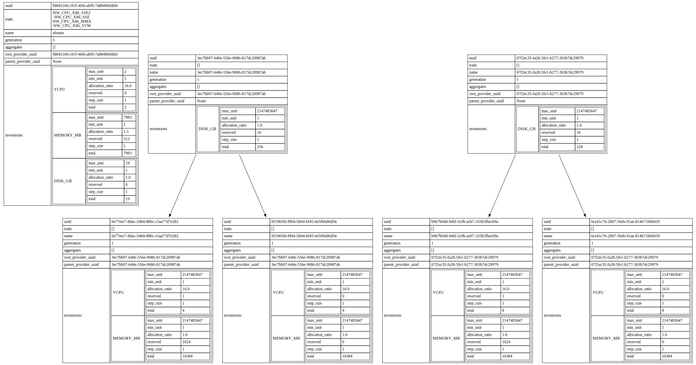

.. image:: https://travis-ci.org/gibizer/osc-placement-tree.svg?branch=master
    :target: https://travis-ci.org/gibizer/osc-placement-tree

==================
osc-placement-tree
==================

OpenStackClient plugin for advanced operations for the Placement service

This is an OpenStackClient plugin, that provides extra CLI commands for the
Placement service. Python API binding is not implemented - Placement API 
consumers are encouraged to use the REST API directly, CLI is provided only
for convenience of users.

* Free software: Apache license

Example
-------
.. code:: bash

  $ openstack resource provider tree list | dot -Tsvg

